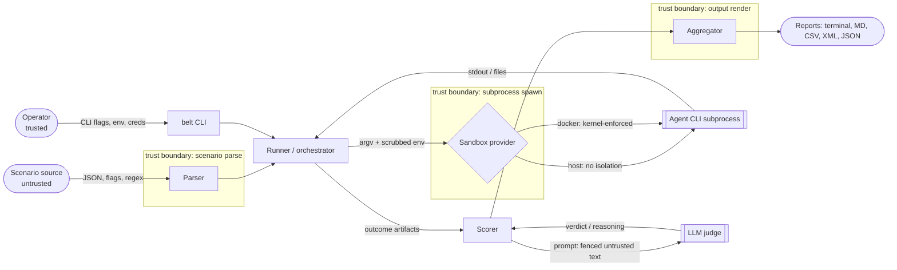

# Security Model

This document is the threat model for `belt`: what it is asked to
defend against, where the trust boundaries are, the controls at each
boundary, and the risks it deliberately does **not** mitigate.

It is the elaboration of one design principle - default-deny plus
escaping every untrusted string
([Principle 8](ARCHITECTURE.md#principle-8-security-model---default-deny--escape-untrusted-text)) -
into a full picture. Read it before changing anything that touches a
subprocess, an output sink, a credential, a filesystem path, or a
network call.

## 1. Purpose and scope

1.1. **In scope.** The `belt` framework: how it loads scenarios,
spawns agent CLIs, scores with an LLM judge, persists artifacts, and
renders reports. The threats are the ones that arise from running
*real, third-party agent CLIs* and *user-authored scenarios* on a
host that also holds the operator's credentials.

1.2. **Out of scope.** The security of the agent CLIs themselves
(Claude Code, Cursor, Codex, and friends), the LLM providers, the
container runtime, and the host OS. `belt` drives those as black
boxes; it cannot make an insecure agent CLI safe.

1.3. **Not a vulnerability-disclosure channel.** This document
describes *shipped, tested* controls and *known, accepted* residual
risk. Suspected vulnerabilities go through
[SECURITY.md](../../SECURITY.md), never a public issue or this file.

1.4. **No duplication.** The per-toggle reference lives in
[CONFIGURATION.md](CONFIGURATION.md#4-behaviour-gates---allow----default-deny);
the sandbox kernel-invariant table lives in
[SANDBOXING.md](SANDBOXING.md). This document links to them rather
than restating them.

## 2. Security posture

`belt` runs the agent CLI you already use, as the user who invokes
it. By default that subprocess has the same reach you do: your
filesystem, your environment, your network, your credentials.
Per-scenario git worktrees scope where *edits* land; they are **not**
an OS-level sandbox. A scenario is therefore code, not data: only run
scenarios you trust, or run untrusted ones under `--sandbox docker`.
This is the posture stated in the [README disclaimer](../../README.md#disclaimer);
everything below is how the framework makes that posture defensible
rather than accidental.

## 3. Assets, actors, and trust boundaries

### 3.1. Actors and zones

| Actor / zone | Trust | What it controls |
|---|---|---|
| Operator (invoker) | Trusted | The `belt` command line, host credentials, `--allow-*` opt-ins |
| Scenario source | **Untrusted when shared** (fork PR, community, vendor) | Scenario JSON, `flags`, regexes, `llm_scorer_instruction`, evidence-file paths, `fixture_repo`, `resources` |
| Agent CLI subprocess | Untrusted output; runs with the operator's privileges unless sandboxed | stdout / NDJSON, files written to the worktree, any syscall the host allows |
| LLM judge | Separate out-of-process model; output is untrusted | `reasoning` strings, per-dimension verdicts |
| Host OS | The target to protect | Filesystem, `$HOME` secrets, network, sibling repos |
| Output sinks | Injection targets | Terminal (Rich), GitHub step summary (Markdown), CSV, JUnit XML, `results.json`, `benchmark-card.json` |

### 3.2. Data-flow diagram

### 3.3. Trust boundaries

Eight edges where data crosses from a less-trusted to a more-trusted
context. Each names the control that guards it; section 5 details the
implementation.

1. **Scenario JSON to parser.** Pydantic models with field limits and
   safe-character patterns; user regexes compiled through one policy;
   path-traversal rejected on every author-supplied path.
2. **Operator environment to agent subprocess.** The env is scrubbed
   to an allow-list; the `BELT_*` and `_BELT_*` namespaces are always
   stripped so the judge's credentials never reach the agent.
3. **Agent subprocess to host.** The sandbox provider: `host` (none)
   or `docker` (kernel-enforced). Per-agent dangerous flags are
   stripped before spawn on every provider.
4. **Agent stdout / judge reasoning to output sinks.** Per-sink
   escaping (Rich, Markdown, CSV, XML) plus ANSI / control stripping.
5. **Scenario instruction to LLM judge.** Untrusted text is XML-fenced
   and the system preamble fixes the rubric; the pass decision is
   recomputed server-side, never trusted from the model.
6. **`belt` to LLM provider.** Base-URL scheme validation blocks
   bearer tokens over plaintext to a non-loopback host.
7. **Remote fixture / resource to workspace.** Scheme allow-list,
   byte cap, archive path-traversal rejection, symlink preservation.
8. **Concurrent `belt` processes to shared outcomes.** File-locked
   manifest with owner-only permissions and PID-reuse defence.

## 4. Threat catalog

STRIDE classification of the principal threats. Each row names the
mitigation and the test that pins it. `S`poofing, `T`ampering,
`R`epudiation, `I`nformation disclosure, `D`enial of service,
`E`levation of privilege.

| # | Threat | STRIDE | Mitigation | Enforced by |
|---|---|---|---|---|
| T1 | A shared scenario edits the operator's real repository | T | git-worktree isolation; `workspace_isolation: none` is default-deny | `TestWorkspaceAutoInitGuard`, schema `Literal` |
| T2 | A malicious `resources` archive writes outside the worktree (`../`, absolute paths) | T,E | entries validated against the destination; tar extracted with the safe filter | `test_install_resources_rejects_zip_with_traversal` |
| T3 | A hostile scenario redirects auto-init / clone at a directory `belt` does not own | T,E | refuse to auto-init a foreign-owned directory unless opted in | `TestWorkspaceAutoInitGuard` |
| T4 | The agent reads host secrets (`~/.aws`, `~/.ssh`) and exfiltrates them | I | `--sandbox docker` (read-only rootfs, no `$HOME`); the default `host` provider is a documented residual risk (section 7) | `test_docker_e2e.py` |
| T5 | The judge's credentials leak into the agent subprocess | I | the entire `BELT_*` / `_BELT_*` namespace is stripped from the child env, even under `--allow-full-env` | `TestSubprocessEnv` |
| T6 | A scenario injects a "skip all permissions" flag (e.g. `--dangerously-skip-permissions`, `--yolo`) | E | per-agent `denied_flags()` stripped before spawn on every provider | `TestAgentDeniedFlagsDefaults` |
| T7 | Prompt-injected agent output makes the judge override the rubric or force a pass | E,S | untrusted text XML-fenced; anti-override system preamble; `overall_pass` recomputed server-side | `TestScenarioInstructionFenced`, `TestLLMJudgePreamble` |
| T8 | Agent output / judge reasoning injects markup into a report (Rich, CSV formula, XML, Markdown) | T | per-sink escaping helpers; design check forbids raw interpolation | `TestSafeHelpers`, `TestStepSummaryUntrustedFence` |
| T9 | A secret is persisted into `run_meta.json` / the benchmark card | I | env snapshot is allow-listed and secret-named values degrade to `<set>`; deny-list applied after allow-list | `TestRunMetaEnvAllowlist` |
| T10 | Bearer tokens sent to an attacker-controlled `http://` endpoint via a hostile `.env` | I | base-URL scheme gate (https, or http to loopback, else opt-in); owner-checked dotenv loader | `TestBaseUrlSchemeValidation`, `TestDotenvGuard` |
| T11 | A runaway or hostile agent exhausts host memory / disk | D | per-line and total stdout caps; NDJSON cap; bounded JSON loads; scenario field limits; cache LRU | `TestBoundedStream`, `TestBoundedJsonLoads`, `TestScoreCacheLRU` |
| T12 | A hostile config imports an arbitrary Python module as an "agent" | T,E | dotted-path import is default-deny behind `--allow-arbitrary-agent` (same for scorer / exporter) | `TestArbitraryRegistryGating` |
| T13 | PID reuse makes orphan cleanup delete a live run's resources | T | manifest records process create-time and compares it on liveness checks | `TestPidCreateTime`, `TestManifestHardening` |
| T14 | World-readable artifacts leak transcripts / caches on a shared host | I | `0o077` umask plus explicit `0o700` / `0o600` on run dirs, caches, and the manifest | `TestUmask`, `TestRunDirectoryPermissions` |

## 5. Control catalog by domain

Each control: what it does, where it lives, and the test that pins it.
Source links point at the module; tests are named so a reader can run
them. (Line numbers are intentionally omitted - they drift.)

### 5.1. Agent isolation and sandboxing

Two providers behind one `--sandbox` selector. `host`
([`runner/sandbox/host.py`](../../src/belt/runner/sandbox/host.py))
is a no-op pass-through and is honestly named: the agent runs on the
host with the invoking user's privileges. `docker`
([`runner/sandbox/docker.py`](../../src/belt/runner/sandbox/docker.py))
runs each agent subprocess with `--cap-drop=ALL`,
`--security-opt=no-new-privileges`, a read-only rootfs, an ephemeral
tmpfs `$HOME`, the worktree as the only writable mount, env passed by
name only, and `--network=none` when `network_policy: none`. A
provider that cannot enforce a requested `SandboxProfile` field
**must** raise rather than silently downgrade (the `host` provider
rejects any non-default `network_policy` for exactly this reason).
Per-scenario git worktrees
([`runner/workspace.py`](../../src/belt/runner/workspace.py)) scope
edits even under `host`. **Pinned by** the kernel-invariant suite in
[`tests/runner/sandbox/test_docker_e2e.py`](../../tests/runner/sandbox/test_docker_e2e.py)
(each invariant in [SANDBOXING.md](SANDBOXING.md) maps to one test).

### 5.2. Workspace and filesystem safety

Author-supplied paths are validated before use: `resources` dest
paths reject `..` and absolute forms and must resolve inside the
worktree; archive entries are checked against the destination and tar
uses the safe-data extractor; remote payloads are size-capped;
worktree labels are reduced to a conservative ASCII alphabet;
`workspace_ref` / `fixture_ref` are matched against a safe-ref
allow-list before reaching `git`. `belt` refuses to auto-initialise a
git repo in a directory owned by another user.
([`runner/workspace.py`](../../src/belt/runner/workspace.py),
[`scenario.py`](../../src/belt/scenario.py)). **Pinned by**
`TestSafeResolve`, `TestWorkspaceRefValidation`,
`TestScenarioNamePattern`, `TestWorkspaceAutoInitGuard`,
`TestWorkspaceLabelSanitization`, and the resource path-traversal tests
in [`tests/test_fixture_resources.py`](../../tests/test_fixture_resources.py).

### 5.3. Argv and dangerous-flag safety

Scenario `message` is untrusted and must never be reparsed as a flag.
Every agent uses one of two safe argv shapes (positional after `--`,
or as the value of a single flag) so a scenario cannot toggle agent
options. Each agent also declares `denied_flags()` - the "skip all
permissions" family for that CLI - which the runner strips before
spawn, on every sandbox provider including `host`.
([`agent/base.py`](../../src/belt/agent/base.py), per-agent modules
under [`agent/`](../../src/belt/agent/)). **Pinned by**
`TestAgentArgvSafetyAutoDiscovery` and `TestAgentDeniedFlagsDefaults`,
parametrised over every registered agent.

### 5.4. Credential and environment hygiene

The agent subprocess receives a minimal environment: a fixed base set
plus the provider keys the agent declares. The `BELT_*` namespace
(the judge's credentials and framework toggles) and the `_BELT_*`
internal handoff namespace are **always** stripped, even under
`--allow-full-env` - that escape hatch covers allow-list gaps, it does
not forward scorer credentials. Anything persisted to disk passes
through one redactor: secret-named values become `<set>`, base URLs are
reduced to scheme and host, and the env snapshot in `run_meta.json` is
allow-listed with the deny-list applied last.
([`agent/base.py`](../../src/belt/agent/base.py),
[`_redact.py`](../../src/belt/_redact.py),
[`scorer/dotenv_safety.py`](../../src/belt/scorer/dotenv_safety.py)).
**Pinned by** `TestSubprocessEnv`, `TestRunMetaEnvAllowlist`,
`TestDotenvGuard`, `TestCredentialMasking`.

### 5.5. Output-injection defense

Agent stdout, judge reasoning, agent `--version` output, scenario tags
and filenames are all attacker-influenced and all reach markup-aware
sinks. Every value is escaped per sink: Rich markup, Markdown prose
and inline code, CSV formula leaders, and XML metacharacters, with
ANSI and ASCII-control stripping layered underneath.
([`_safe.py`](../../src/belt/_safe.py),
[`_sanitize.py`](../../src/belt/_sanitize.py)). The design check
(`scripts/check_design.py`) fails the build on raw interpolation into
a markup sink. **Pinned by** `TestSafeHelpers`,
`TestStepSummaryUntrustedFence`, `TestXmlDelimitersInJudge`.

### 5.6. LLM-judge prompt-injection defense

The judge sees agent output, workspace files, the scenario JSON, and
any `llm_scorer_instruction` - all untrusted. The system preamble
states that everything in the user message is data, never
instructions, and that the rubric, scale, and pass rule are fixed and
cannot be overridden. The scenario instruction is wrapped in a
`<scenario_instruction>` fence with nested closing tags neutralised,
so it cannot impersonate a system message. `overall_pass` is
recomputed from the per-dimension verdicts rather than trusted from
the model, closing the "hedge to a pass" hole. Evidence-file paths are
resolved relative to the scenario directory and rejected if they
escape it. ([`scorer/llm/scorer.py`](../../src/belt/scorer/llm/scorer.py)).
**Pinned by** `TestScenarioInstructionFenced`, `TestLLMJudgePreamble`,
`TestXmlDelimitersInJudge`.

### 5.7. Network egress and transport

A judge base URL must be `https://`, or `http://` to a loopback host,
or carry an explicit insecure opt-in; any other scheme is rejected so
a hostile `.env` cannot redirect bearer tokens to an attacker over
plaintext. Inside the docker sandbox, `network_policy: none` removes
every interface but loopback at the kernel; `open` keeps the bridge
network (`allowed_hosts` is a best-effort DNS hint, not an egress
firewall - see section 7).
([`scorer/llm/backend.py`](../../src/belt/scorer/llm/backend.py),
[`runner/sandbox/docker.py`](../../src/belt/runner/sandbox/docker.py)).
**Pinned by** `TestBaseUrlSchemeValidation` and the network tests in
`test_docker_e2e.py`.

### 5.8. Resource limits and denial of service

A misbehaving or hostile agent cannot exhaust the host unbounded:
per-line and total stdout caps, a per-turn NDJSON cap, bounded and
depth-limited JSON parsing of agent state, scenario field-length and
turn-count limits, a per-turn message-render cap, and an LRU cap on
the judge response cache. ([`agent/base.py`](../../src/belt/agent/base.py),
[`scenario.py`](../../src/belt/scenario.py),
[`scorer/llm/cache.py`](../../src/belt/scorer/llm/cache.py)).
**Pinned by** `TestBoundedStream`, `TestNdjsonCaps`,
`TestBoundedJsonLoads`, `TestScenarioFieldLimits`,
`TestRenderedMessageLimit`, `TestScoreCacheLRU`.

### 5.9. Supply chain and plugin boundary

Agents, scorers, and exporters resolve from a built-in registry, then
entry points, then - only behind an explicit `--allow-arbitrary-*`
opt-in - a dotted import path, so a hostile config cannot import an
arbitrary module by default. Plugins may import only the published
top-level surface; the design check fails on internal-path imports.
([`agent/registry.py`](../../src/belt/agent/registry.py),
[`scorer/registry.py`](../../src/belt/scorer/registry.py),
[`exporter/registry.py`](../../src/belt/exporter/registry.py),
[`_public_api.py`](../../src/belt/_public_api.py)). **Pinned by**
`TestArbitraryRegistryGating` and the plugin-boundary design check.

### 5.10. Concurrency and process lifecycle

Multiple `belt` processes can share one outcomes directory. Manifest
mutations are serialised through a file lock, the manifest is rewritten
owner-only, and orphan cleanup compares a recorded process create-time
to defeat PID reuse before invoking any delete callback. Agent
subprocesses run in their own session group so a timeout kills the
whole tree without reaching back to `belt`.
([`manifest.py`](../../src/belt/manifest.py),
[`agent/base.py`](../../src/belt/agent/base.py)). **Pinned by**
`TestManifestHardening`, `TestPidCreateTime`, `TestKillProcessTree`.

## 6. Default-deny behaviour gates

Every gate that lowers a boundary is off by default and needs an
explicit `--allow-*` flag (or matching `BELT_ALLOW_*` env var) to
enable. Treat each as *risk accepted for this invocation*. The full
per-gate reference is in
[CONFIGURATION.md](CONFIGURATION.md#4-behaviour-gates---allow----default-deny);
the risk framing:

| Gate | What you accept by enabling it |
|---|---|
| `--allow-full-env` | The agent inherits your full environment (minus the `BELT_*` namespaces). Unrelated host secrets flow into the agent. |
| `--allow-insecure-base-url` | Bearer tokens to the judge travel in cleartext to a non-loopback host. |
| `--allow-inplace` | Scenarios run without per-scenario worktree isolation, directly in the working directory. |
| `--allow-external-working-dir` | A scenario's `working_dir` may resolve outside the scenarios root. |
| `--allow-arbitrary-agent` / `-scorer` / `-exporter` | A dotted import path is loaded, executing arbitrary module code at process start. |

Only the canonical truthy tokens (`1`, `true`, `yes`) enable a gate; a
typo such as `TRUE` or `0` leaves it closed, so a malformed value
fails safe.

## 7. Residual risks and explicit non-mitigations

These are deliberate boundaries, not regressions. Each pairs with the
action that closes it.

7.1. **The default `host` provider has no OS-level isolation.** The
agent runs as you, with your filesystem, network, and secrets. This is
inherent to "drive the CLI you already use" and is stated in the
README disclaimer. *Action:* run untrusted scenarios under
`--sandbox docker`; for stronger isolation author a `BaseSandboxProvider`
plugin (microVM, gVisor) per [PLUGGABILITY.md](PLUGGABILITY.md).

7.2. **The minimal subprocess environment still forwards provider
credentials.** So that an agent can auto-detect its own provider, the
default allow-list includes common provider keys (OpenAI, Anthropic,
Google, and the AWS credential set among them). "Minimal" means "not your
whole environment," not "no credentials." *Action:* under
`--sandbox docker`, env crosses by exact name only via
`sandbox.env_passthrough`; forward nothing you do not need.

7.3. **Agent-config-level restriction is out of scope.** `belt`
blocks the dangerous *flags* it knows about, but it does not write
per-CLI permission files into each worktree - those schemas drift per
agent and an adversarial scenario can often undo them. Kernel-level
isolation is the supported answer. *Action:* use `--sandbox docker`
rather than relying on agent self-restriction.

7.4. **`network_policy: open` is not an egress firewall.**
`allowed_hosts` is a best-effort `--add-host` DNS hint; it does not
block other outbound traffic. Only `network_policy: none` is
kernel-enforced. *Action:* use `none` for offline scenarios; do not
treat `allowed_hosts` as a containment boundary.

7.5. **Trusted-author path semantics.** A bare local `fixture_repo` /
`working_dir` resolves through symlinks and may contain `..`, by
design, because the scenario author is trusted in that model. A
hostile scenario run from a hostile CWD could exploit this. *Action:*
run scenarios from sources you trust; sandbox the rest.

7.6. **Group config is permissive by default.** Unknown keys in
`_config.json` are ignored (so plugins can extend it), which is a
typo trap: a misspelled key is silently dropped. Security-relevant
fields fail safe (a dropped `workspace_isolation` key falls back to
the isolated default), but coverage can be silently lost. *Action:*
run CI with `--strict-config` to reject unknown keys.

7.7. **Kernel isolation is Linux + docker today.** There is no
bundled macOS Seatbelt or seccomp/Landlock provider. *Action:* on
macOS/Windows, isolate via a Linux container host or a custom
provider.

## 8. Shared-responsibility model

| Responsibility | Owner |
|---|---|
| Isolation primitive, env scrub, output escaping, default-deny gates, redaction | Framework |
| Choosing `--sandbox docker` for untrusted scenarios; not passing `--allow-*` blindly; running from a trusted CWD; managing host credentials; enabling `--strict-config` in CI | Operator |
| `validate_profile()` that raises on any unenforceable field; `denied_flags()`; safe argv shapes; public-API-only imports; escaping untrusted text in custom renderers | Plugin author |

Plugin contracts are specified in [PLUGGABILITY.md](PLUGGABILITY.md);
the sandbox-provider invariants in [SANDBOXING.md](SANDBOXING.md).

## 9. Provenance and auditability

Each run records what it did so a reviewer can reconstruct it:
`resource_lock.json` pins every installed resource by name, kind,
source, destination, version, and source SHA-256; `run_meta.json`
carries the redacted env snapshot and invocation; the benchmark card
records run identity, agent and judge provenance, and cost - all with
the same redaction applied. See [OUTCOMES.md](OUTCOMES.md) for the
artifact shapes.

## 10. Reporting a vulnerability

Do not open a public issue. Follow [SECURITY.md](../../SECURITY.md).

## 11. Maintaining this document

Per [Principle 10](ARCHITECTURE.md#principle-10-documentation-travels-with-code),
any change that adds, removes, or weakens a control - a new
`BELT_ALLOW_*` gate, a new sandbox field, a change to env scrubbing or
output escaping - updates sections 4 through 6 in the same PR. When you
add a control, add the test that pins it and name that test here. A
documented control with no test is not a control.
